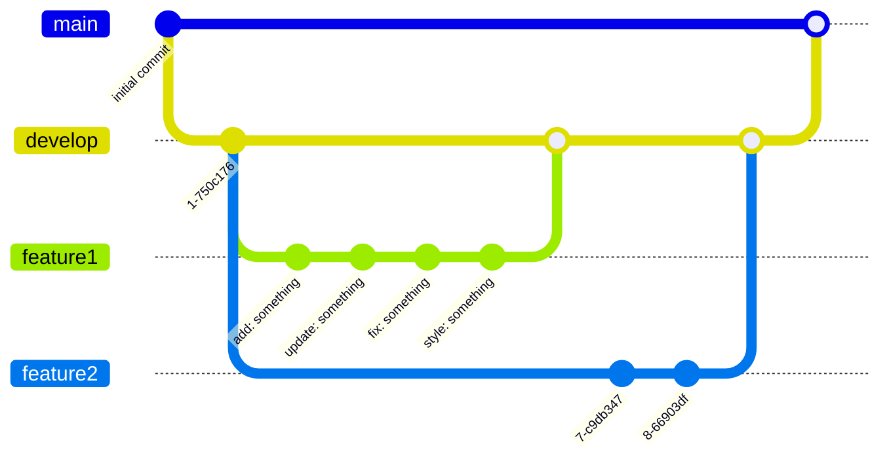

# Git WorkFlow規約

## ブランチ戦略

意図しないデプロイやCI/CDの実行を避けるため
`develop`ブランチから作業ブランチを作成し、作業する。
**`main`ブランチへのPRは人間が実施** する。



## ブランチ命名

- `feature/<内容>`: 新機能の追加
- `refactor/<内容>`: 動作に変更のない改善
- `fix/<内容>`: バグ修正
- `docs/<内容>`: 開発用資料の追加や変更
- `chore/<内容>`: ソースコード以外()の変更

### GitHub Issueやタスク管理ツールから起因する変更の場合

修正がGitHub Issue や、ClickUpなどのタスク管理サービスから起因している場合は、
その番号またはIDを先頭に付与する。

- issue番号がある場合は先頭に含める(例: `feature/123-add-login`)
- チケットIDがある場合は先頭に含める(例: `feature/<ticket-id>-add-login`)

## コミットメッセージ

`<type>: <説明>` の形式で書く。説明は命令形・簡潔に。

- `add`: 新規追加
- `update`: 既存の変更・改善
- `style`: コードフォーマットの変更
- `fix`: バグ修正
- `remove`: 削除
- `refactor`: 振る舞いを変えないコード整理
- `chore`: ソースコード以外(依存関係、ビルドやCI/CD設定)の変更

```text
# BAD
コミット

# GOOD
update: ユーザー認証のエラーハンドリングを追加
```

## コミット・PRの粒度

- 1つのコミットは1つの論理的変更に絞る(フォーマット変更と機能追加を混ぜない)。
- 1つのPRは1つの目的に絞る。レビューしやすさを優先し、無関係な変更を含めない。
- 巨大な差分になる場合は、意味のある単位でコミットを分割する。

## マージ・リベース方針

- feature/fixブランチをmainに追従させる際は、公開済みの共有ブランチに対する force-push を避ける(自分のfeatureブランチ上でのrebaseは可)。
- コンフリクト解消は自動解決に頼らず、両方の変更意図を確認してから解消する。
