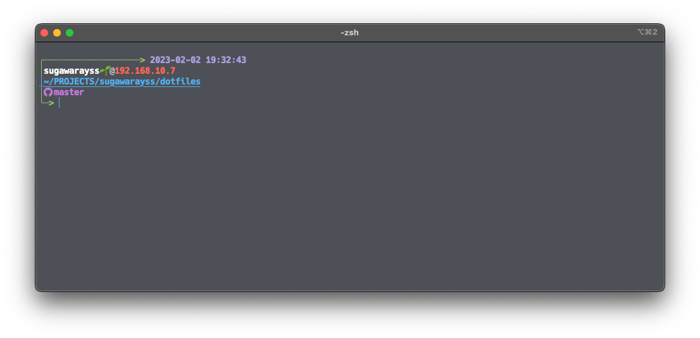

# sugawarayss's dotfiles
My dotfiles for MacOSX.

## Quick Start
- clone this repository
- deplpy
  - rum `make <target keyword>`
    - KEYWORDS
      - zsh
        - make symbolic link of `.zshrc` & `.zprofile` to home directory
      - brew_restore
        - run `brew bundle` by Brewfile in this repository
      - brew_dump
        - run `brew bundle dump` to Brewfile
      - vim
        - make symbolic link of neovim configuration to `~/.config/nvim/`
      - git
        - make symbolic link of git configuration files (global gitignore & commit_message_template) to `~/.config/git/`
      - warp
        - make symbolic link of warp conf files to `~/.warp/`
      - tig
        - make symbolic link of `.tigrc` to home directory
      - tmux
        - make symbolic link of `tmux.conf` to home directory
      - ideavim
        - make symbolic link of `.ideavimrc` (vimrc for vim plugin rcfile of jetbrains ide) to home directory
      - helix
        - make symbolic link of helix editor conf files to `~/.config/helix/`
      - starship
        - make symbolic link of `starship.toml` to `~/.config/starship.toml`

## Details
 - zshrc
 - zprofile
 - [staship](https://starship.rs/ja-jp/)
   - terminal promp app made by rust
 - [nvim](https://neovim.io/doc/user/index.html)
   - neovim configuration file and plugins
     - using lua
 - [helix](https://helix-editor.com/)
   - editor made by rust
 - [tig](https://github.com/jonas/tig)
   - git client cli
 - [warp](https://www.warp.dev/)
   - terminal app made by rust
 - [git](https://git-scm.com/)
   - git global configuration files
 - [brew](https://brew.sh/index_ja)
   - manage formula
 - [ideavim](https://pleiades.io/help/idea/using-product-as-the-vim-editor.html)
   - vim plugin configuration for Jetbrains IDE

## Screenshots
TODO ...
