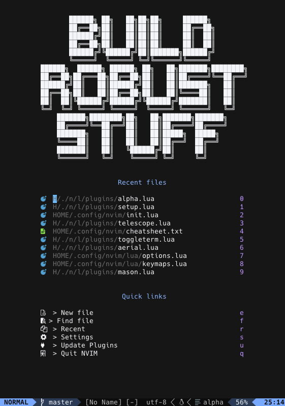

# my dotfiles
My dotfiles for MacOSX.

## Quick Start

- run `make <target keyword>`
    - details see [Makefile](./Makefile)

## Contents
- [zsh](https://zsh.sourceforge.io/Doc/Release/zsh_toc.html) - resource files for zsh
- [Homebrew](https://brew.sh/index_ja) - my Brewfile
- [Git](https://git-scm.com/) - git global configuration files
- [Tig](https://github.com/jonas/tig) - keybinds configuration
- [Starship](https://starship.rs/ja-jp/) - my prompt configuration
- [NeoVim](https://neovim.io/doc/user/index.html) - my neovim configuration and plugins
- [Helix](https://helix-editor.com/) - my helix configuration
- [ideavim](https://pleiades.io/help/idea/using-product-as-the-vim-editor.html) - Jetbrains IDE vim plugin keybind configuration
- [Warp.app](https://www.warp.dev/) - terminal app made by rust

### Neovim Plugins

| Plugin Name                                                                                           | Description                                                    |
| ----------------------------------------------------------------------------------------------------- | -------------------------------------------------------------- |
| [stevearc/aerial.nvim](https://github.com/stevearc/aerial.nvim)                                       | バッファのアウトラインを表示する                               |
| [goolord/alpha-nvim](https://github.com/goolord/alpha-nvim)                                           | ダッシュボードのカスタマイズ                                   |
| [akinsho/bufferline.nvim](https://github.com/akinsho/bufferline.nvim)                                 | バッファをGUIエディタのようにタブ表示                          |
| [tyru/capture.vim](https://github.com/tyru/capture.vim)                                               | バッファ領域にコマンドの出力結果を表示する                     |
| [catppuccin/nvim](https://github.com/catppuccin/nvim)                                                 | カラーテーマ                                                   |
| [sudormrfbin/cheatsheet.nvim](https://github.com/sudormrfbin/cheatsheet.nvim)                         | チートシートをpopupで表示する                                  |
| [hrsh7th/cmp-buffer](https://github.com/hrsh7th/cmp-buffer)                                           | バッファ内補完                                                 |
| [hrsh7th/cmp-nvim-lsp](https://github.com/hrsh7th/cmp-nvim-lsp)                                       | Language Serverを使用した補完                                  |
| [hrsh7th/cmp-path](https://github.com/hrsh7th/cmp-path)                                               | ファイルパス補完                                               |
| [Decodetalkers/csv-tools.lua](https://github.com/Decodetalkers/csv-tools.lua)                         | CSVファイルのハイライト                                        |
| [Shougo/ddc.vim](https://github.com/Shougo/ddc.vim)                                                   | 自動保管エンジン                                               |
| [vim-denops/denops.vim](https://github.com/vim-denops/denops.vim)                                     | Neovimでdenoを利用できるようにする                             |
| [monaqa/dial.nvim](https://github.com/monaqa/dial.nvim)                                               | インクリメント機能を拡張                                       |
| [lambdalisue/fern-git-status.vim](https://github.com/lambdalisue/fern-git-status.vim)                 | ファイラーにGitステータスを表示                                |
| [yuki-yano/fern-preview.vim](https://github.com/yuki-yano/fern-preview.vim)                           | ファイラーのツリーでプレビューを表示                           |
| [lambdalisue/fern-renderer-nerdfont.vim](https://github.com/lambdalisue/fern-renderer-nerdfont.vim)   | ファイラーでNerd系フォントを使用                               |
| [lambdalisue/fern.vim](https://github.com/lambdalisue/fern.vim)                                       | ファイラー                                                     |
| [j-hui/fidget.nvim](https://github.com/j-hui/fidget.nvim)                                             | LSPの進捗情報をバッファの右下に表示                            |
| [dinhhuy258/git.nvim](https://github.com/dinhhuy258/git.nvim)                                         | Neovim からgitを操作                                           |
| [lewis6991/gitsigns.nvim](https://github.com/lewis6991/gitsigns.nvim)                                 | バッファのガターにGit情報を表示                                |
| [phaazon/hop.nvim](https://github.com/phaazon/hop.nvim)                                               | カーソルジャンプを拡張                                         |
| [lukas-reineke/indent-blankline.nvim](https://github.com/lukas-reineke/indent-blankline.nvim)         | インデントガイドを表示                                         |
| [lambdalisue/kensaku.vim](https://github.com/lambdalisue/kensaku.vim)                                 | インクリメンタルサーチで日本語をローマ字で検索                 |
| [lambdalisue/kensaku-search.vim](https://github.com/lambdalisue/kensaku-search.vim/tree/main)         | /コマンドで日本語を検索できる                                  |
| [ray-x/lsp_signature.nvim](https://github.com/ray-x/lsp_signature.nvim)                               | 関数シグネチャを表示                                           |
| [onsails/lspkind.nvim](https://github.com/onsails/lspkind.nvim)                                       | 補完リストにピクトグラムを表示                                 |
| [nvim-lualine/lualine.nvim](https://github.com/nvim-lualine/lualine.nvim)                             | Neovim のステータスラインを拡張                                |
| [iamcco/markdown-preview.nvim](https://github.com/iamcco/markdown-preview.nvim)                       | markdown をプレビュー                                          |
| [williamboman/mason-lspconfig.nvim](https://github.com/williamboman/mason-lspconfig.nvim)             | mason.nvim からLSPを使えるようにする                           |
| [jay-babu/mason-null-ls.nvim](https://github.com/jay-babu/mason-null-ls.nvim)                         | mason.nvim からnull-lsを使えるようにする                       |
| [williamboman/mason.nvim](https://github.com/williamboman/mason.nvim)                                 | language server の管理                                         |
| [lambdalisue/nerdfont.vim](https://github.com/lambdalisue/nerdfont.vim)                               | NerdFont を使えるようにする                                    |
| [folke/noice.nvim](https://github.com/folke/noice.nvim)                                               | 通知やコマンドライン系UI(cmdline, notify, message) をモダン化  |
| [jose-elias-alvarez/null-ls.nvim](https://github.com/jose-elias-alvarez/null-ls.nvim)                 | LSPによる解析結果を表示する                                    |
| [myusuf3/numbers.vim](https://github.com/myusuf3/numbers.vim)                                         | ノーマルモード時にline numberを相対数で表示                    |
| [windwp/nvim-autopairs](https://github.com/windwp/nvim-autopairs)                                     | 括弧を自動で閉じる                                             |
| [hrsh7th/nvim-cmp](https://github.com/hrsh7th/nvim-cmp)                                               | 補完エンジン                                                   |
| [norcalli/nvim-colorizer.lua](https://github.com/norcalli/nvim-colorizer.lua)                         | カラーコードを色付けして表示                                   |
| [mfussenegger/nvim-dap](https://github.com/mfussenegger/nvim-dap)                                     | デバッグ実行                                                   |
| [mfussenegger/nvim-dap-python](https://github.com/mfussenegger/nvim-dap-python)                       | pythonデバッグ                                                 |
| [rcarriga/nvim-dap-ui"](https://github.com/rcarriga/nvim-dap-ui)                                      | デバッグ用UIを提供                                             |
| [neovim/nvim-lspconfig](https://github.com/neovim/nvim-lspconfig)                                     | LSP設定                                                        |
| [kylechui/nvim-surround](https://github.com/kylechui/nvim-surround)                                   | 囲う系の動作を拡張する                                         |
| [nvim-treesitter/nvim-treesitter](https://github.com/nvim-treesitter/nvim-treesitter)                 | syntax highlight                                               |
| [kevinhwang91/nvim-ufo](https://github.com/kevinhwang91/nvim-ufo)                                     | 折り畳み                                                       |
| [kyazdani42/nvim-web-devicons](https://github.com/nvim-tree/nvim-web-devicons)                        | telescope の検索結果にアイコンを表示する                       |
| [rgroli/other.nvim](https://github.com/rgroli/other.nvim)                                             | jump to code,test code inter file                              |
| [wbthomason/packer.nvim](https://github.com/wbthomason/packer.nvim)                                   | プラグインマネージャ                                           |
| [nvim-treesitter/playground](https://github.com/nvim-treesitter/playground)                           | view treesitter infomation directly in Neovim                  |
| [mechatroner/rainbow_csv](https://github.com/mechatroner/rainbow_csv)                                 | CSVを色付け                                                    |
| [sunjon/Shade.nvim](https://github.com/sunjon/Shade.nvim)                                             | 非アクティブなウィンドウを 暗く表示                            |
| [vim-skk/skkeleton](https://github.com/vim-skk/skkeleton)                                             | 日本語 IME                                                     |
| [lpoto/telescope-docker.nvim](https://github.com/lpoto/telescope-docker.nvim)                         | dockerコマンドの結果を telescope で表示                        |
| [nvim-telescope/telescope-ui-select.nvim](https://github.com/nvim-telescope/telescope-ui-select.nvim) | vim.ui.selectをTelescopeに置き換える                           |
| [tom-anders/telescope-vim-bookmarks.nvim](https://github.com/tom-anders/telescope-vim-bookmarks.nvim) | telescope で ブックマークを検索                                |
| [nvim-telescope/telescope.nvim](https://github.com/nvim-telescope/telescope.nvim)                     | fuzzy finder                                                   |
| [folke/todo-comments.nvim](https://github.com/folke/todo-comments.nvim)                               | TODO コメントをハイライト                                      |
| [alinsho/toggleterm.nvim](https://github.com/akinsho/toggleterm.nvim)                                 | ターミナルをfloating window で表示                             |
| [tom-anders/telescope-vim-bookmarks.nvim](https://github.com/tom-anders/telescope-vim-bookmarks.nvim) | ブックマークをTelescopeで検索                                  |
| [tpope/vim-commentary](https://github.com/tpope/vim-commentary)                                       | コメントアウト                                                 |
| [itchyny/vim-gitbranch](https://github.com/itchyny/vim-gitbranch)                                     | ステータスバーにgitブランチ名を表示する                        |
| [andymass/vim-matchup](https://github.com/andymass/vim-matchup)                                       | jump to match keywords                                         |
| [kana/vim-smartword](https://github.com/kana/vim-smartword)                                           | w/bモーションでの移動をスマートにする                          |
| [voldikss/vim-translator](https://github.com/voldikss/vim-translator)                                 | 翻訳 日本 - 英語                                               |
| [hrsh7th/vim-vsnip](https://github.com/hrsh7th/vim-vsnip)                                             | スニペット                                                     |
| [folke/which-key.nvim](https://github.com/folke/which-key.nvim)                                       | キーバインドにヒントを表示                                     |
| [simeji/winresizer](https://github.com/simeji/winresizer)                                             | 分割したwindowサイズを調整できるようにする                     |
